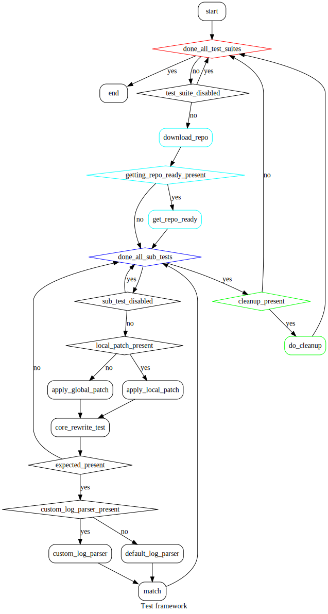

# Model Level Testing for nGraph Bridge

## Introduction
**_TODO_**

### Directory Structure
This section describes the directory structure. Indentation means sub-directories. Top to bottom, roughly, they are in the order in which they are executed
1. `test_main.py`: The CLI to trigger different tests.
2. `models`: The directory containing all test suites.
    1. `Test suite` or `Model test directory` (*Repeated*): A directory in `models`. Each `test suite` represents an external repo that must be downloaded. Usually that corresponds to a particular network topology (but certain repos might run multiple topologies).
        1. `README.md` (*Optional*): Information about this `test suite`. Expected to be short as this text is used by `test_main.py` to print a short help on available tests.
        2. `repo.txt`: Clonable git URL in the first line, Optionally branch/SHA/tag in the second line (by default master will be used)
        3. `getting_repo_ready.sh` (*Optional*): An executable shell script to run before the tests start running for this repo. Can be used to install prerequisites.
        4. `enable_ngraph.patch` (*Optional*): A patch to be applied to the downloaded repo (**2.1.2**). If this file exists it is used by all `sub-test` directories (**2.1.5**), unless overridden by their own patch file (**2.1.5.1**). Either a global or a local patch file must be present.
        5. `Sub-test` (*Repeated*): Should start with the string `test`. Can be disabled by adding the string `disabled` to its name.
            1. `enable_ngraph.patch` (*Optional*): If a `sub-test` contains its own patch, that takes precedence over the global patch (**2.1.4**)
            2. `core_rewrite_test.sh`: The main run script for this `sub-test`.
            3. `expected.json` (*Optional*): A json file containing expected results. See **Expected results format**.
            4. `custom_log_parser.py` (*Optional*): See **Terminology 3** and **Terminology 3.1**.
            5. `README.md` (*Optional*): Information about this `sub-test`. Expected to be short as this text is used by `--list`.
        6. `cleanup.sh` (*Optional*): An executable shell script that will be used to clean up, potentially the effects of `getting_repo_ready.sh` (**2.1.3**)
    2. `Non-repo based Test Suite` (*Repeated*): `Test suites` can also be based on `pb`, `pbtxt` or `savedmodel` instead of being based on a repo
        1. ~~`repo.txt`~~: A non repo based `test suite` should not contain a `repo.txt`.
        2. ~~`getting_repo_ready.sh`~~: It should not contain `getting_repo_ready.sh`.
        3. ~~`enable_ngraph.patch`~~: Neither can it have a patch file.
        4. `README.md` (*Optional*): It might have a `README`. Same description as **2.1.1**.
        5. `Sub-test` (*Repeated*):
            1. `pbtxt/pb/savedmodel`: One TF model file per `sub-test`.
            2. `expected.json` (*Optional*): A json file containing expected results. See **Expected results format**.

### Terminology:
1. `test suite` or `model test directory`:
    1. `repo based`: See **Directory Structure 2.1**.
    2. `non-repo based`: See **Directory Structure 2.2**.
2. `sub-test`: See **Directory Structure 2.1.5, 2.2.5**.
3. `patch file`: To enable ngraph, make the tests short enoough to run, to add prints etc. Can be global (to a `test-suite`) or local to each `sub-test`. See **Directory Structure 2.1.4, 2.1.5.1**.
4. `log parser`: A default log parsing function `parse_logs` that parses the output of `NGRAPH_TF_LOG_PLACEMENT=1` is present in `tools/log_parser.py`.
    1. `custom log parser`: A python file named `custom_log_parser.py` that contains a function named `custom_parse_logs`. This can be placed in a `sub-test` directory if required. If a custom parser is present, tests are not run with any flags such as `NGRAPH_TF_LOG_PLACEMENT=1` and it is up to the user to use such flags in `core_rewrite_test.sh` if they need it. The patch file (**Directory Structure 2.1.4, 2.1.5.1**) which can modify the repo by adding prints, and the `custom log parser`, the user can write tests that check accuracy/throughput and other metrics.
5. `configuration`: **_TODO_**

### Expected results format
Expected results are specified in a json file of the following format:
1. `configuration` (*Repeated*, *Optional*): Perhaps changing the ngraph backend means different expected results. Generally the `default` configuration is used
    1. `logparse` (*Optional*): Results of parsing `NGRAPH_TF_LOG_PLACEMENT=1` with the default `log parser` in the normal case, or parsing the (user-generated) logs with the `custom log parser`.
        1. `graph id` (*Repeated*, *Optional*): Integers
            1. `num_nodes_in_graph` (*Optional*)
            2. `num_nodes_marked_for_clustering` (*Optional*)
            3. `num_ng_clusters` (*Optional*)
            4. to be expanded as the default `log parser` produces more information.
    2. `time` (*Optional*): Time in seconds.

## Features and sample uses

**_TODO_**

Dumping some points:
* dumps shell script at the end. dumps shell script even when the framework crashes
* prints list of tests and their descriptions (--list)
* "expected" values can be varied by different configs
* cleanup script
* sub tests folders must start with 'test' (else ignored). Can have 'disabled' in their names to disable
* default and user-specified log parsers (named custom_log_parser.py, which is expected to contain a function custom_parse_logs)
* filename is supposed to be expected.json
* enable_ngraph can be placed in each test dir or in the model dir for all subtests to share. test folder's patch overrides global model folder patch

